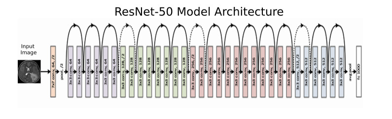

# Project Eagle Vision
Before I go over anything else, here's a link the website hosting the app:

[Eagle Vision Homepage](http://ec2-52-39-236-240.us-west-2.compute.amazonaws.com:8501/)

Technologies used: 
* Python
* Pytorch
* Streamlit
* Docker
* AWS EC2
* AWS Sagemaker
* AWS S3

# Summary
This project involved using Deep Convolutional Neural network to create a machine learining application that could classify 250 bird species based on images. The model architecture is a [ResNet50](https://en.wikipedia.org/wiki/Residual_neural_network) that was initially trained on the [ImageNet Dataset](https://en.wikipedia.org/wiki/ImageNet). Transfer learning was utilized to fine tune the ImageNet model to learn how to classify birds. After training, the model correctly identified 97% of bird images held out from training. The trained model was then deployed in an interactive website to allow users to identify their own bird pictures.

# Introduction
My girlfriend and I love to birdwatch. She is extremely talented at identifying the species of a bird based on very few cues. I on the other hand - am not so great at identification. Although I enjoy birdwatching just as much, I am nowhere near as good at identification. Just like I rely on my smartphone's naviagation features to circumvent my lack of direction, I thought: why not use what I am good at - machine learning! With the help of a little math, the tables have turned and now I am the one who is better at identification.

# Dataset

# Model Architecture

# Future direcitons
I have several ideas to improve this project:
* Add wikipedia link to bird species in pandas dataframe for each predicted species
* Add explanations for how the CNN works with multiple levels of explanation depending on user selection of dropbox
* If predicted confidence is under some threshold, say something about not being sure about the prediction
* Potentially have a stacked model where the first model predicts if the image is a bird or not - if not, do something funny to the user for trying to trick me
